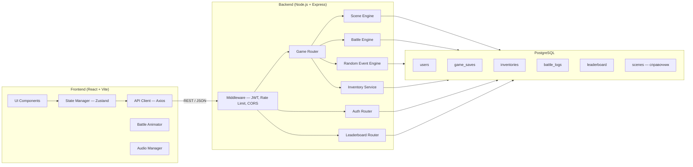
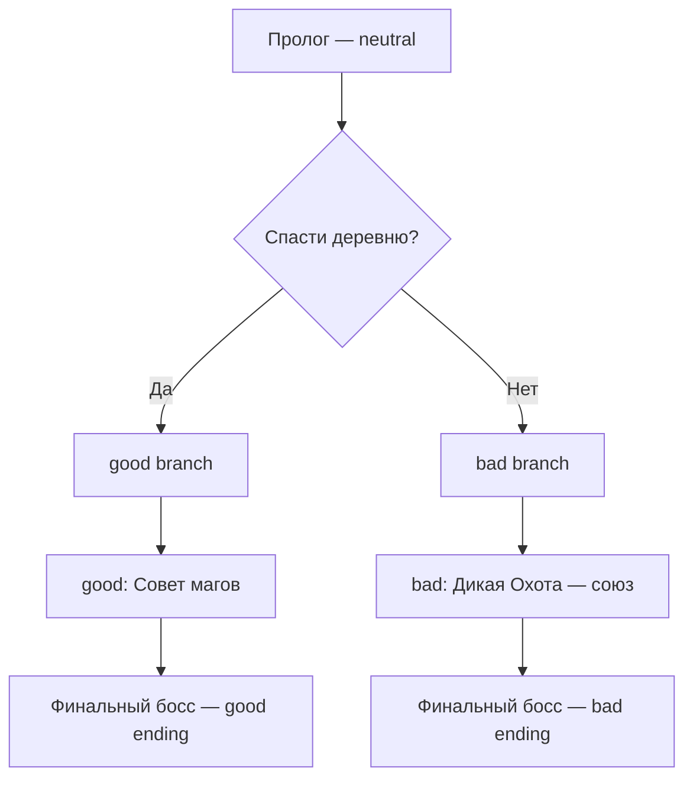
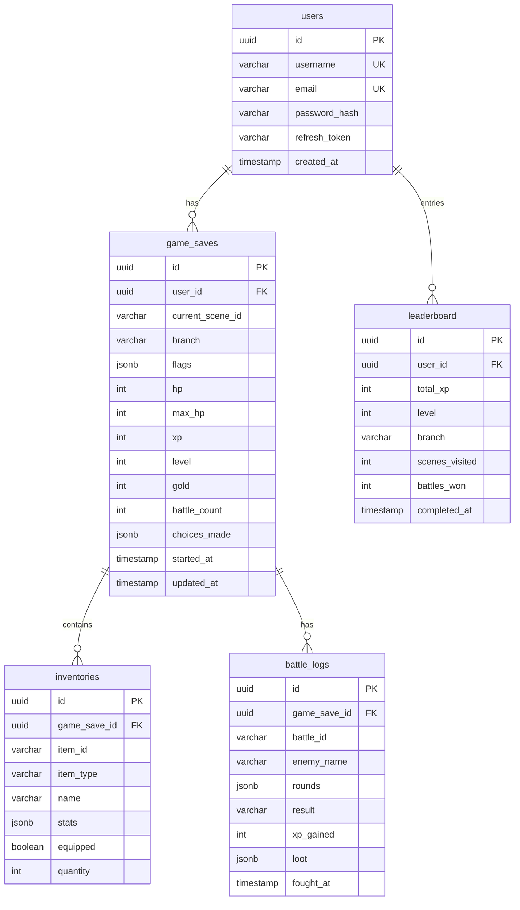
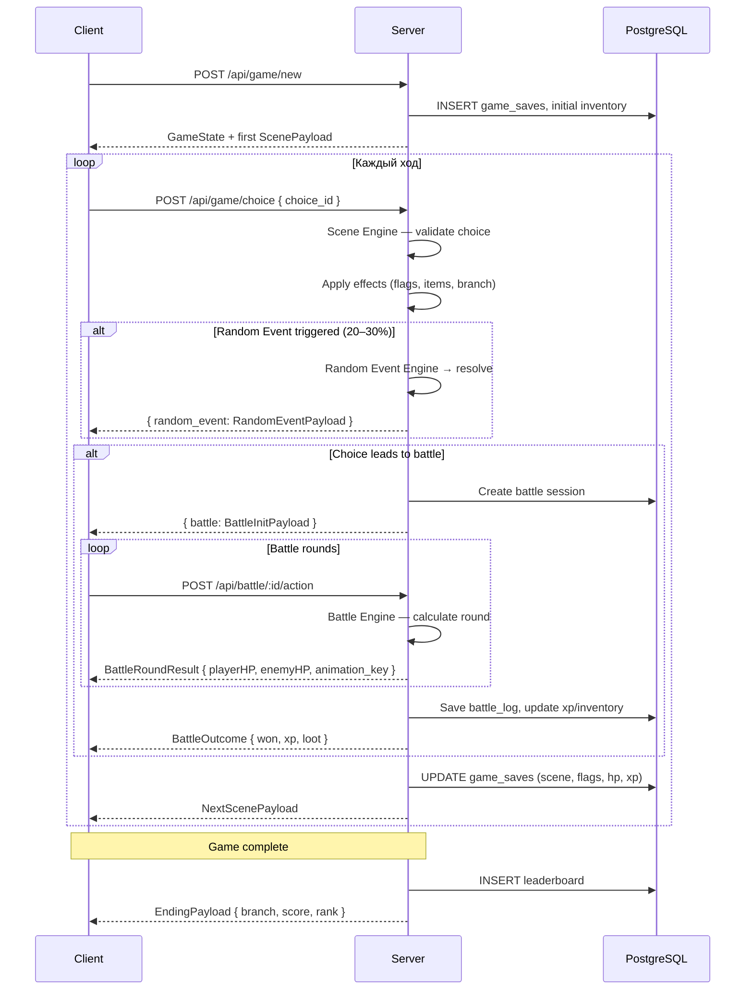
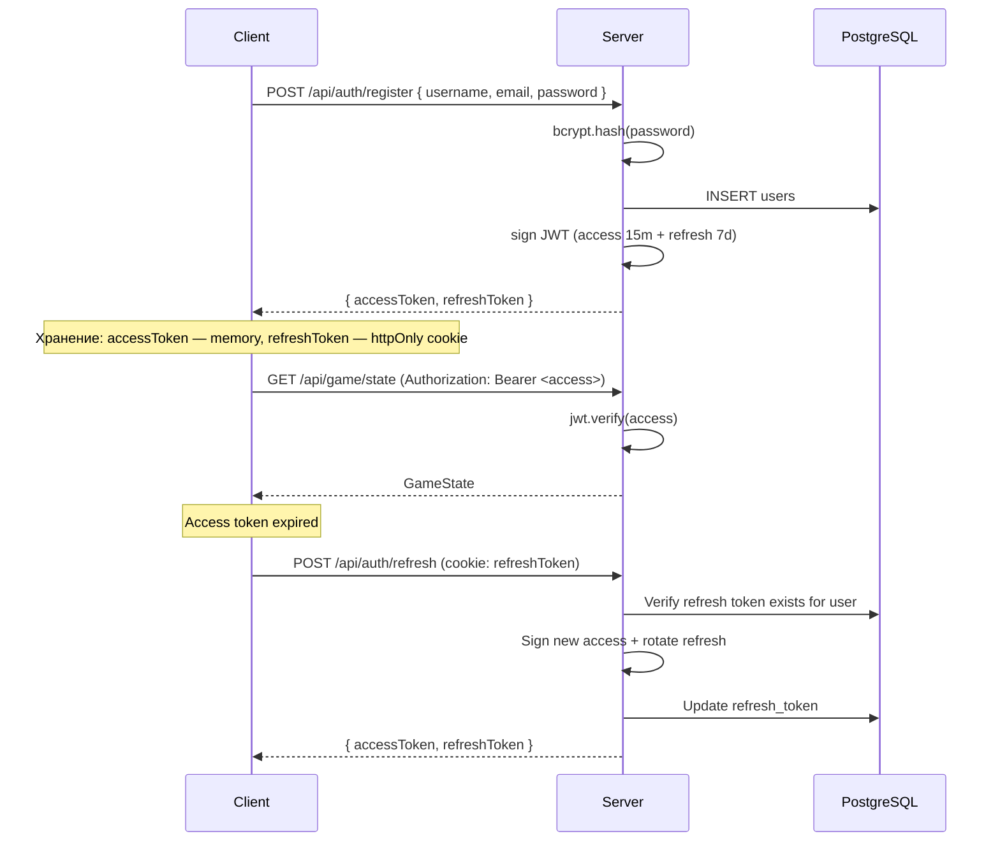

# Архитектура RPG-квеста «Ведьмак: Путь Геральта»

---

## 1. Общая архитектура



**Принципы:**
- Frontend — stateless SPA, единственный source of truth — backend + БД.
- Backend — stateless REST API; горизонтально масштабируется за load balancer.
- PostgreSQL — единственное persistence-хранилище.
- JWT — bearer-token в `Authorization` header; refresh через отдельный эндпоинт.

---

## 2. Scene Engine

### 2.1 Концепция

Каждая сцена — JSON-узел в ориентированном графе. Граф хранится на сервере в виде JSON-файлов (или seed-данных в БД). Engine на каждый запрос:

1. Загружает текущую сцену из `game_saves.current_scene_id`.
2. Отдаёт клиенту `ScenePayload`.
3. Принимает `choice_id` от клиента.
4. Валидирует переход: проверяет `requires` (предметы, флаги).
5. Применяет `effects` (добавить/убрать предмет, установить флаг, начать бой, trigger random event).
6. Обновляет `game_saves`.

### 2.2 Структура сцены

```
Scene {
  id: string                    // "crossroads_01"
  branch: "good" | "bad" | "neutral"
  title: string
  text: string                  // нарративный блок
  background: string            // URL изображения
  music: string                 // ключ трека: "kaer_morhen_theme"
  choices: Choice[]
  random_event_pool: string[]   // id возможных random events
  random_event_chance: number   // 0.2–0.3
}

Choice {
  id: string
  label: string
  next_scene_id: string
  requires: Condition | null    // { item: "silver_sword" } или { flag: "saved_villagers" }
  effects: Effect[]             // [{ type: "add_item", item: "key_to_tower" }, { type: "set_flag", flag: "chose_good_path" }]
  leads_to_battle: string | null  // battle_id
  branch_switch: "good" | "bad" | null
}
```

### 2.3 Ветвление сюжета

- Два основных ствола: `good` и `bad`.
- Переключение ветки — через `branch_switch` в `Choice.effects`.
- Нейтральные сцены (`branch: "neutral"`) доступны обоим стволам.
- При ветвлении в `game_saves.branch` записывается текущая ветка; Engine фильтрует доступные `choices` по совместимости с текущей веткой.



---

## 3. Структура игровых состояний

### 3.1 Серверное состояние (`game_saves`)

```
GameState {
  id: uuid
  user_id: uuid
  current_scene_id: string
  branch: "good" | "bad" | "neutral"
  flags: Record<string, boolean>   // JSONB: { "saved_villagers": true, "has_yen_amulet": false }
  hp: number                       // 0–100
  max_hp: number
  xp: number
  level: number
  gold: number
  battle_count: number
  choices_made: string[]           // JSONB: history of choice IDs
  started_at: timestamp
  updated_at: timestamp
}
```

### 3.2 Клиентское состояние (Zustand store)

```
UIState {
  // Зеркало серверных данных (read-only cache):
  scene: ScenePayload | null
  gameState: GameState | null
  inventory: InventoryItem[]

  // Чисто клиентские:
  isBattleActive: boolean
  battleAnimation: BattleFrame[]
  currentTrack: string | null
  isLoading: boolean
  error: string | null
}
```

> Клиент **никогда** не модифицирует `GameState` напрямую — только через API-вызовы.

---

## 4. Структура API

### 4.1 Auth

| Method | Endpoint | Описание |
|--------|----------|----------|
| POST | `/api/auth/register` | Регистрация (`username`, `email`, `password`) → JWT |
| POST | `/api/auth/login` | Логин → `{ accessToken, refreshToken }` |
| POST | `/api/auth/refresh` | Обновление access token |
| POST | `/api/auth/logout` | Инвалидация refresh token |

### 4.2 Game

| Method | Endpoint | Описание |
|--------|----------|----------|
| POST | `/api/game/new` | Создать новую игру → `GameState` |
| GET | `/api/game/state` | Текущее состояние → `GameState` |
| GET | `/api/game/scene` | Текущая сцена → `ScenePayload` |
| POST | `/api/game/choice` | Сделать выбор: `{ choice_id }` → `{ nextScene, effects, randomEvent? }` |
| GET | `/api/game/inventory` | Инвентарь → `InventoryItem[]` |
| POST | `/api/game/use-item` | Использовать предмет: `{ item_id }` |

### 4.3 Battle

| Method | Endpoint | Описание |
|--------|----------|----------|
| GET | `/api/battle/:id` | Данные боя (враг, его HP) |
| POST | `/api/battle/:id/action` | Действие: `{ type: "attack" | "parry" | "sign" | "potion", detail? }` → `BattleResult` |

### 4.4 Leaderboard

| Method | Endpoint | Описание |
|--------|----------|----------|
| GET | `/api/leaderboard` | Топ-100: `{ username, xp, level, branch, completed_at }` |
| POST | `/api/leaderboard/submit` | Авто-вызов при завершении игры |

---

## 5. Модель данных (PostgreSQL)



### Типы предметов (`item_type`)

| Тип | Примеры | `stats` (JSONB) |
|-----|---------|-----------------|
| `weapon` | Стальной меч, Серебряный меч | `{ damage: 15, type: "steel" }` |
| `armor` | Кольчуга, Доспех школы Волка | `{ defense: 10, resist: "physical" }` |
| `key` | Ключ от башни, Медальон | `{ unlocks: "tower_door" }` |
| `potion` | Ласточка, Гром | `{ heal: 30 }` или `{ damage_boost: 1.5, duration: 1 }` |

---

## 6. Поток прохождения игры



---

## 7. Поток авторизации



**Детали:**
- Access token: **15 минут**, payload: `{ userId, username }`.
- Refresh token: **7 дней**, хранится хешированным в `users.refresh_token`.
- Middleware `authGuard` — декодирует JWT, прикрепляет `req.user`.
- Все `/api/game/*` и `/api/battle/*` — за `authGuard`.
- `/api/leaderboard` GET — публичный.

---

## 8. Логика случайных событий

### 8.1 Механика

1. При переходе на новую сцену Engine проверяет `scene.random_event_pool`.
2. Если пул не пуст → бросок: `Math.random() < scene.random_event_chance`.
3. При срабатывании — выбирается случайное событие из пула.
4. Событие возвращается клиенту **вместе** с `NextScenePayload`.
5. Некоторые события требуют реакции (выбор), некоторые автоматические.

### 8.2 Структура события

```
RandomEvent {
  id: string                     // "ambush_drowners"
  type: "combat" | "loot" | "encounter" | "trap"
  title: string
  text: string
  effects: Effect[]              // немедленные эффекты (урон, лут)
  battle_id: string | null       // если type === "combat"
  choices: EventChoice[] | null  // если есть варианты реакции
  condition: Condition | null    // доп. условие (только branch: good, или flag)
}
```

### 8.3 Типы событий

| Тип | Вероятность (из пула) | Пример |
|-----|----------------------|--------|
| `combat` | 40% | Засада утопцев на болоте |
| `loot` | 25% | Найден сундук с зельем «Ласточка» |
| `encounter` | 25% | Странник просит помощи — выбор влияет на `flags` |
| `trap` | 10% | Ловушка — потеря 10 HP, если нет `flag: trap_sense` |

### 8.4 Предотвращение повторов

- В `game_saves.flags` записывается `event_<id>_seen: true`.
- Engine фильтрует пул: если событие уже видели → исключает из выборки.
- Если весь пул вычеркнут → событие не срабатывает.

---

## 9. Система боя

### 9.1 Модель

Пошаговый бой. Каждый раунд:

1. Игрок выбирает действие: `attack` | `parry` | `sign` | `potion`.
2. Враг выбирает действие (серверная AI-логика: weighted random по типу врага).
3. Результат раунда рассчитывается:

| Игрок → Враг | attack | parry |
|-------------|--------|-------|
| **attack** | Оба получают урон | Враг блокирует, контратака |
| **parry** | Игрок блокирует, контратака | Ничья — оба ждут |
| **sign** | Магический урон, игнорирует parry | Частичный блок |
| **potion** | Игрок лечится, враг бьёт | Игрок лечится безопасно |

4. Урон = `weapon.damage × modifier − enemy.defense`.
5. Бой до `hp ≤ 0` одной из сторон.
6. Проигрыш → откат на предыдущую сцену, потеря 50% gold.
7. Победа → `xp`, возможный `loot`, обновление `battle_count`.

### 9.2 Анимация на Frontend

- Сервер возвращает `animation_key` для каждого раунда: `"slash"`, `"parry_counter"`, `"igni_cast"`, `"drink_potion"`.
- Frontend маппит ключ на CSS/Framer Motion анимацию.
- Sprite sheet или Lottie-анимации для Геральта и врагов.

---

## 10. Музыка по сценам

- Каждая `Scene` содержит поле `music: string` — ключ трека.
- Frontend `AudioManager` (singleton, через `useContext`):
  - При смене `scene.music` → кроссфейд (fade out текущий → fade in новый, 1.5s).
  - Треки: `/public/audio/{key}.mp3`.
  - Отдельный трек для боя: `battle_theme`.
  - Пользовательский контроль громкости, mute.

---

## 11. Структура проекта

```
web-quest/
├── client/                     # React + Vite
│   ├── public/
│   │   ├── audio/              # MP3 треки
│   │   └── sprites/            # Анимации боя
│   └── src/
│       ├── api/                # Axios client, interceptors
│       ├── components/
│       │   ├── Scene/          # SceneView, ChoiceList
│       │   ├── Battle/         # BattleArena, BattleHUD, animations
│       │   ├── Inventory/      # InventoryPanel, ItemCard
│       │   ├── Leaderboard/    # LeaderboardTable
│       │   └── Auth/           # LoginForm, RegisterForm
│       ├── hooks/              # useAuth, useGameState, useAudio
│       ├── store/              # Zustand stores
│       ├── pages/              # MainMenu, GamePage, LeaderboardPage
│       └── utils/              # constants, helpers
│
├── server/                     # Node.js + Express
│   ├── config/                 # db, jwt, cors config
│   ├── middleware/             # authGuard, errorHandler, rateLimiter
│   ├── routes/                 # auth, game, battle, leaderboard
│   ├── services/
│   │   ├── SceneEngine.js
│   │   ├── BattleEngine.js
│   │   ├── RandomEventEngine.js
│   │   └── InventoryService.js
│   ├── models/                 # Sequelize / Knex models
│   ├── data/
│   │   ├── scenes/             # JSON-файлы сцен
│   │   ├── enemies/            # JSON-файлы врагов
│   │   └── events/             # JSON-файлы random events
│   ├── migrations/             # DB migrations
│   └── index.js
│
├── .env
├── docker-compose.yml          # postgres + server + client
└── README.md
```
